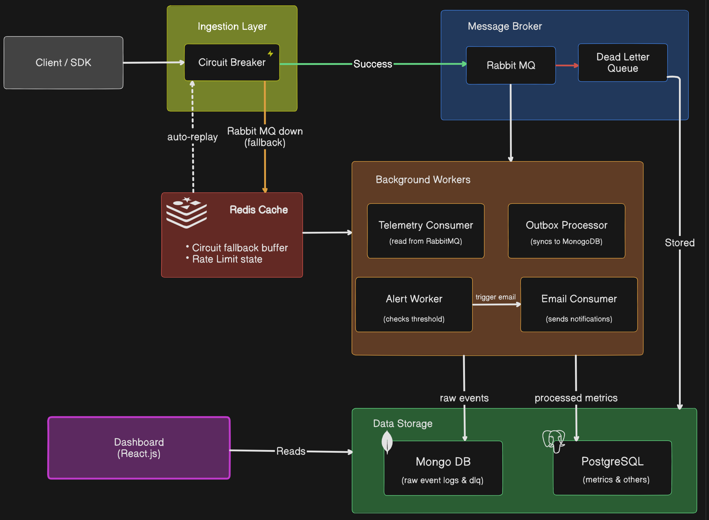

<div align="center">
  <h1>🛰️ Monito</h1>
  <p><strong>A comprehensive, full-stack API Monitoring & Telemetry Platform.</strong></p>

[](https://nodejs.org/)
[](https://react.dev/)
[](https://www.typescriptlang.org/)
[](https://www.postgresql.org/)
[](https://www.mongodb.com/)
[](https://www.rabbitmq.com/)
[](https://redis.io/)

</div>

<hr />

Monito ingests, queues, processes, and visualizes massive volumes of API telemetry events. It tracks **latency**, **error rates**, **traffic patterns**, and **service health** - and fires **email alerts** when your metrics breach configured thresholds.

Main Link -> https://api-monitoring-system-nine.vercel.app/
Link to Test System -> https://api-monitoring-system-q5pp-amber.vercel.app/
---

## ✨ Key Features at a Glance

| Feature                          | Detail                                                                              |
| -------------------------------- | ----------------------------------------------------------------------------------- |
| 🏗️ **Class-Based Architecture**  | Every layer is a proper TypeScript class with JSDoc, following SOLID principles     |
| ⚡ **Circuit Breaker**           | `opossum` wraps the RabbitMQ publisher - Redis buffer activates on failure          |
| 📥 **Outbox Pattern**            | Atomic writes to Postgres → async projection to MongoDB for raw event storage       |
| 🪣 **Time-Bucketed Metrics**     | Custom `toBucket()` utility floors timestamps into 1m / 1h aggregation buckets      |
| ⚠️ **Alert Engine**              | Cron job evaluates rules per project, fires alert email via RabbitMQ                |
| 🔐 **HMAC-SHA256 Security**      | SDK signs every batch; backend verifies the cryptographic signature                 |
| 🪙 **Token Bucket Rate Limiter** | Redis-backed Lua script - 500 token burst cap, 50 tokens/s refill per API key       |
| 📦 **Drop-in SDK**               | `MonitoAPI` class auto-captures Express request timings with zero model boilerplate |
| 🌐 **Multi-Tenant**              | All data scoped by `tenant_id` and `project_id` in both databases                   |

---

## 🏛️ Architecture & Data Flow

<br/>
<p align="center">
  
</p>

---

## 🔍 Architecture Deep-Dives

<details>
<summary><b>🏗️ Class-Based Programming</b></summary>
<br>

The backend is written entirely in **TypeScript** with a strict class-based, object-oriented structure. Every layer has a clear single responsibility:

| Class                 | Responsibility                                            |
| --------------------- | --------------------------------------------------------- |
| `IngestionService`    | Validates service limits, delegates to circuit breaker    |
| `IngestionController` | HTTP handler - translates requests to service calls       |
| `Circuit`             | `opossum` wrapper - fire, fallback, replay Redis buffer   |
| `CircuitRegistry`     | Singleton store for the active `Circuit` instance         |
| `MetricsStore`        | Atomic Postgres transaction - metrics + outbox write      |
| `OutboxProcessor`     | Background poll loop - projects outbox entries to MongoDB |
| `MongoProjector`      | Creates `RawEvent` Mongoose documents from payloads       |
| `AlertsService`       | Alert CRUD + background rule evaluation engine            |
| `AlertWorker`         | Cron tick - calls `AlertsService.evaluateProjectRules`    |
| `TenantRepository`    | Project CRUD - bcrypt hashing for `api_secret`            |
| `MonitoAPI` (SDK)     | Client-side middleware class - batch, sign, flush         |

All functions use JSDoc comments in the format:

```typescript
/**
 * Brief description of what the function does.
 * @param {Type} paramName - Description
 * @returns {Type} Description
 */
```

</details>

<details>
<summary><b>⚡ Circuit Breaker (before RabbitMQ)</b></summary>
<br>

The `Circuit` class in `server/src/config/circuit.ts` wraps the raw RabbitMQ `publish` call using [`opossum`](https://github.com/nodeshift/opossum).

**Key configuration:**

```typescript
{
  timeout: 2000,               // 2s timeout per publish attempt
  errorThresholdPercentage: 50, // trip after 50% failures
  resetTimeout: 15000,         // attempt recovery every 15s
  volumeThreshold: 10,         // minimum 10 requests before evaluating
  capacity: 5000,              // max concurrent in-flight requests
}
```

**States:**

- `CLOSED` → Normal operation. Events publish directly to RabbitMQ.
- `OPEN` → RabbitMQ is down. `fallbackHandler` pushes events to a Redis list (`telemetry_buffer`). Every 10s, a background interval also sweeps and replays orphaned buffer entries.
- `HALF-OPEN` → A probe request is sent. On success → `CLOSED` + replay buffer. On failure → back to `OPEN`.

**Replay with exponential backoff**: Failed replay attempts back off using `min(1000 * 2^attempt, 30000) + jitter(500ms)`. After 5 failed attempts, the message moves to the **Dead Letter Buffer** (`telemetry_buffer_dead`) in Redis.

</details>

<details>
<summary><b>📥 Outbox Pattern</b></summary>
<br>

The [Transactional Outbox Pattern](https://microservices.io/patterns/data/transactional-outbox.html) guarantees that your aggregated PostgreSQL metrics and your raw MongoDB event log are **always in sync** - even if MongoDB goes down temporarily.

**Write path (atomic):**

```sql
BEGIN;
  INSERT/UPDATE minute_metrics ...
  INSERT/UPDATE hourly_metrics ...
  INSERT INTO outbox_entries (event_id, payload, status='pending') ...
COMMIT;
```

**Async projection path:**
The `OutboxProcessor` polls `outbox_entries WHERE status='pending'` every 5 seconds, then calls `MongoProjector.project()` to write a `RawEvent` document to MongoDB. On success it marks the entry as `processed`. On failure after 3 retries, it marks as `failed`.

This means MongoDB stores the **raw, immutable event stream** while PostgreSQL stores **aggregated, query-optimised metrics** - two different shapes of the same truth.

</details>

<details>
<summary><b>🪣 Time-Bucketed Metrics</b></summary>
<br>

Rather than storing one Postgres row per API request (which would explode for high-traffic APIs), Monito **pre-aggregates** events into time buckets on the way in, using an `UPSERT` conflict strategy.

The `toBucket()` utility in `shared/utils/timebucket.ts` floors any timestamp to its bucket boundary:

```typescript
// 2026-04-08T05:37:23Z → granularity "1m" → 2026-04-08T05:37:00Z
toBucket(new Date(), "1m");
```

Supported granularities: `1m | 5m | 15m | 1h | 1d`

**Two PostgreSQL tables are maintained:**

- `minute_metrics` - 1-minute buckets, retained for 24 hours (auto-deleted by cleanup job)
- `hourly_metrics` - 1-hour buckets, retained indefinitely for trend analysis

Each row tracks `total_requests`, `success_count`, `failure_count`, `total_latency`, `min_latency`, and `max_latency` per `(project, service, environment, endpoint, method, bucket)`. The Alert Engine also queries `minute_metrics` directly to evaluate window-based rules.

</details>

<details>
<summary><b>⚠️ Alert Engine</b></summary>
<br>

`AlertWorker` runs as a background cron job that periodically calls `AlertsService.evaluateProjectRules()` for all projects with active rules.

**Supported metrics:**

- `error_rate` - `SUM(failure_count) / SUM(total_requests) * 100` over a configurable time window
- `latency` - `SUM(total_latency) / SUM(total_requests)` average
- `request_count` - raw total over the window

**Alert lifecycle:**

1. `AlertWorker` evaluates each enabled rule
2. If the metric breaches the threshold → `triggerAlert()`
3. An `alert_history` entry is written and the rule is **silenced** until its `cooldown_minutes` elapses (prevents email spam)
4. If `send_email = true`, an email payload is published to the `email_alerts` RabbitMQ queue
5. The `EmailConsumer` worker picks it up and sends via **Nodemailer / SMTP**
6. When the metric recovers naturally, the rule auto-resolves

Users can also manually resolve alerts from the dashboard.

</details>

<details>
<summary><b>🔐 HMAC-SHA256 Security</b></summary>
<br>

The SDK (`sdk/index.js`) never sends your API Secret as plaintext in every request. Instead, it computes a **cryptographic signature** of the payload:

```javascript
// Signature = HMAC-SHA256(apiSecret, bodyJson + timestamp)
const signature = createHmac("sha256", this.#apiSecret)
  .update(bodyStr + timestamp)
  .digest("hex");
```

This signature and an `x-timestamp` are sent as HTTP headers (`x-signature`, `x-timestamp`).

**On the backend**, `apiKeyMiddleware` re-derives the expected signature using the stored secret and compares using `crypto.timingSafeEqual()` (preventing timing-based signature attacks). A **±5 minute timestamp drift check** rejects replayed requests.

This means:

- The raw `api_secret` never travels the wire after initial setup
- Replay attacks are blocked by timestamp validation
- Forged payloads are cryptographically rejected
</details>

<details>
<summary><b>🪙 Token Bucket Rate Limiter</b></summary>
<br>

The ingestion endpoint is protected by a **Redis-backed Token Bucket** rate limiter implemented as a Lua script evaluated atomically in Redis.

**Config:**

```
Capacity:    500 tokens (max burst)
Refill Rate: 50 tokens/second (= 3,000 requests/min sustained)
Cost:        1 token per request
```

The Lua script is atomic (no race conditions) and returns remaining tokens + a `reset_secs` value used for `RateLimit-Remaining` / `Retry-After` headers (IETF RateLimit RFC draft-6 compliant).

A global IP-based limiter (`express-rate-limit`) separately caps all routes at 1,000 requests per 15-minute window. Auth routes get a stricter cap of 20 per 15 minutes.

**Fail-open**: If Redis is temporarily unavailable, the middleware calls `next()` rather than blocking all traffic.

</details>

<details>
<summary><b>📦 SDK Integration</b></summary>
<br>

The `MonitoAPI` class is a zero-dependency Express middleware you drop into any Node.js app.

```javascript
const { MonitoAPI } = require("monito-api");

const monito = new MonitoAPI({
  apiKey: "your-api-key",
  apiSecret: "your-api-secret",
  serverUrl: "http://localhost:3000",
  environment: "production",
  batchSize: 15,
});

// Option A - Microservice: tag every route globally
app.use(monito.init("user-service"));

// Option B - Monolith: tag individual routers as distinct services
app.post("/api/checkout", monito.service("billing-service"), checkoutHandler);
```

**Under the hood:**

- A local buffer accumulates events in memory
- Events flush automatically when `batchSize` is reached OR every `flushInterval` (5s default)
- Each event is HMAC-SHA256 signed before sending
- Failed requests retry up to 3× with exponential backoff
- `destroy()` flushes buffer on graceful server shutdown
</details>

---

## 🛠️ Tech Stack

| Layer              | Technology                                                           |
| ------------------ | -------------------------------------------------------------------- |
| **Runtime**        | Node.js 18+, Express 5, TypeScript 5                                 |
| **Auth**           | JWT (access/refresh), Google OAuth 2.0 (Passport.js), bcryptjs       |
| **Primary DB**     | PostgreSQL - auth, projects, aggregated metrics, outbox, alert rules |
| **Document DB**    | MongoDB - raw immutable event log (`RawEvent` documents)             |
| **Cache / Buffer** | Redis - circuit buffer, token bucket state, session store            |
| **Message Broker** | RabbitMQ - telemetry queue, retry queue, DLQ, email alert queue      |
| **Frontend**       | React 19, Vite, Redux Toolkit, Tailwind CSS, Recharts                |
| **SDK**            | Vanilla JS class - no dependencies except Node built-ins             |

---

## 🛠️ Prerequisites

Ensure you have the following running locally (or via Docker):

- **[Node.js](https://nodejs.org/en)**: `v18` or newer
- **[PostgreSQL](https://www.postgresql.org/)**: Port `5432`
- **[MongoDB](https://www.mongodb.com/)**: Port `27017` or Atlas
- **[Redis](https://redis.io/)**: Port `6379`
- **[RabbitMQ](https://www.rabbitmq.com/)**: Port `5672`

> **💡 Tip:** A `docker-compose.yml` is included in `/server`. Run `docker-compose up -d` to spin up all four dependencies instantly.

---

## 🚀 Quick Start

### 1. Backend (`/server`)

```bash
cd server
cp .env.example .env    # Fill in your DB URIs and secrets
npm install
npm run dev
```

> API Server → `http://localhost:3000`

### 2. Dashboard (`/client`)

```bash
cd client
npm install
npm run dev
```

> Dashboard → `http://localhost:5173` - Sign up, create a project, copy your API Keys.

### 3. Chaos Simulator (`/demo`)

```bash
cd demo
npm install

# Terminal 1 - mock backend APIs
npm run start

# Terminal 2 - React demo UI
npm run dev
```

> Demo UI → `http://localhost:5174` - paste your keys, fire simulated traffic, watch the dashboard light up.

---

## 📦 SDK Usage

```bash
npm install /path/to/API-Monitoring-System/sdk
```

**Microservice (tag all routes as one service):**

```javascript
const { MonitoAPI } = require("monito-api");

const monito = new MonitoAPI({
  apiKey: "your-dashboard-api-key",
  apiSecret: "your-dashboard-api-secret",
  serverUrl: "http://localhost:3000",
  environment: "production",
  batchSize: 15,
});

// Every route captured under "user-service"
app.use(monito.init("user-service"));
```

**Monolith (split routes into distinct logical services on the dashboard):**

```javascript
// This route appears under "billing-service" on your dashboard
app.post("/api/checkout", monito.service("billing-service"), checkoutHandler);

// This route appears under "inventory-service"
app.get("/api/products", monito.service("inventory-service"), productsHandler);
```

---

## 🛡️ Security & Resiliency

- **HMAC-SHA256 Signatures**: Every SDK batch is cryptographically signed. The backend rejects any payload with a missing or invalid signature, and rejects requests with a timestamp older than ±5 minutes to block replay attacks.
- **bcrypt API Secrets**: The `api_secret` is bcrypt-hashed before database storage. The raw secret is shown to the user once on project creation and never stored in plaintext.
- **Token Bucket Rate Limiter**: Redis-backed, Lua-atomic rate limiter prevents ingestion abuse per API key.
- **Circuit Breaker**: RabbitMQ failures never block your HTTP `/ingest` responses - events are safely buffered in Redis and replayed automatically.
- **Helmet**: Secure HTTP headers on all responses.
- **Dead Letter Queues**: Failed telemetry projections after 5 retries are moved to a permanent DLQ, viewable from the Admin panel in the dashboard.
